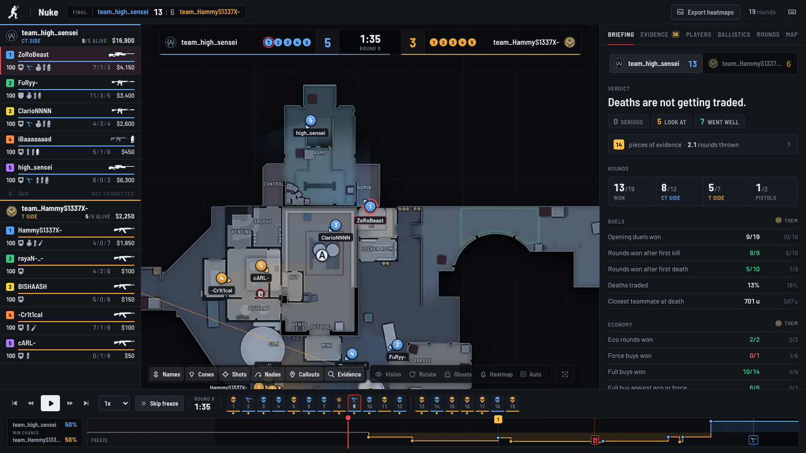
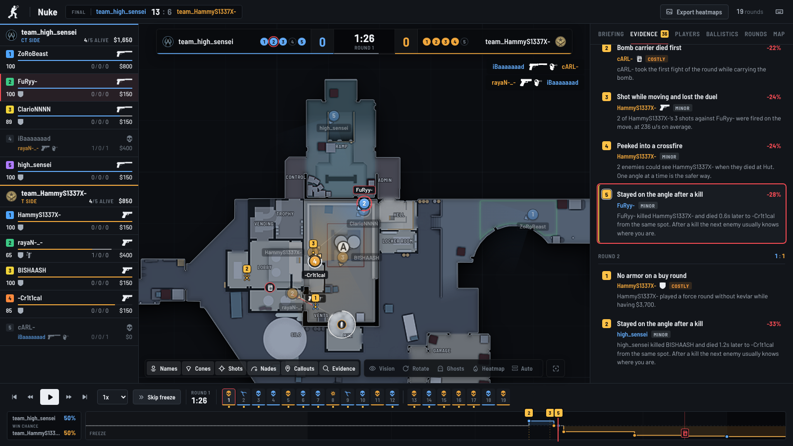
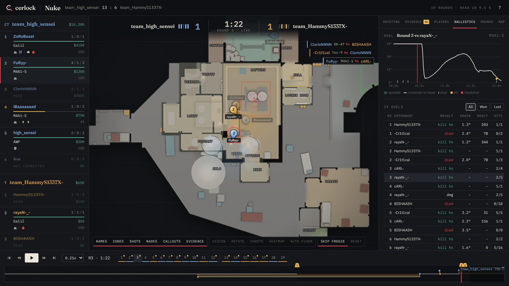

# CerlockCS

A fast CS2 demo viewer and review tool for teams.

Drop in a demo and watch every round on a 2D radar. Follow any player around the map, see every smoke, flash and molotov, and get a list of things the team (or a single player) should work on. Every finding and every mistake links to the exact moment in the demo, so you can click it and watch what happened.

The name is Sherlock with the "Sh" swapped for the C in CS. A demo is treated like a case: every round leaves evidence, and Cerlock lays it out for you.



## Features

**Replay**
- Players drawn as small pins that point where they look, with health, weapon, utility and money
- Smokes with a countdown ring, molotov fire, HE and flash pops, grenade trajectories, shot tracers, kill lines and the bomb
- Lines from each flash to the players it blinded, with the blind time (red if it was a teammate)
- Callout names on the map (Ramp, Heaven, Outside...) taken from the demo itself, and site letters where the bomb was planted
- Follow a player by clicking them or pressing 1 to 0. Optionally rotate the map with their view
- Team vision: only show the enemies the followed player's team could actually see
- Ghosts: where a team stood at the same point in every other round on the same side, good for spotting setups and habits
- Heatmaps for positions, kills and deaths, per player, per team or for a single callout
- Two level maps (Nuke, Train, Vertigo) switch floor automatically

**Evidence (mistakes)**

Cerlock goes through every round and pulls out single mistakes you can watch. Each one shows up as a numbered marker on the map and on the timeline, and clicking it jumps a few seconds before it happened and follows the player.

- Team kills, team damage and dying to a teammate's flash
- Dying while reloading or while blind from your own flash
- Peeking into a crossfire, or staying on the same angle after a kill and getting traded
- Dying with a lot of unused utility, or without armor on a buy round
- The bomb carrier taking the first fight, running out of time on T side, dying to the bomb, defusing too late
- Buying out of sync with the team, molotovs that burned for a second, shooting while running

Every mistake has a cost: how much the team's chance to win the round dropped because of it. That makes it easy to sort the small stuff from what actually lost rounds.



**Win chance**
- A simple model of players alive and the bomb gives a win chance for every moment of the round, drawn on the timeline
- Round swing per player: how much each player moved their team's win chance over the match, from kills, deaths and plants

**Team review**
- Opening duels, traded deaths, rounds won after the first kill, pistols, eco and anti-eco rounds, post-plants and retakes, utility per round, team flashes and unused utility
- Findings like "Deaths are not getting traded", "Losing anti-eco rounds" or "Losing fights at Bombsite A", each with the rounds and ticks it is based on
- Map control: kills and deaths per callout and side, where the team keeps losing fights and where it wins them, and how long it spends in each area
- Round notes: the setup each team played, when and where the T side hit, and a short story of the round (opening kill, trades, big swings, clutches)

**Player report**
- K/D/A, ADR, KAST, HLTV 1.0 rating, kills and deaths per round, round swing, split by CT and T side
- Opening duels, trades and average time to trade, isolated and early deaths, clutches, multi kills
- Utility: flash blind time per flash, HE and molotov damage per nade, teammates flashed
- Movement: time alive, distance travelled, shots fired while standing still, average kill distance
- Kills per weapon and the callouts where a player gets most kills and dies the most
- Personal findings, for example dying where nobody can trade, flashing teammates, shooting while moving or crosshair placement

**Aim**
- Every duel is cut out at full tick rate and measured: crosshair placement when the enemy showed up, reaction time to the first shot, time to damage, first shot error and flick size
- A chart of how far the crosshair was from the enemy's head over the whole fight
- Numbers are compared against everyone else in the same game



**Library**
- Drag and drop a demo, or point the server at a folder (for example your CS2 replays folder) and new demos are parsed in the background
- Reads `.dem` as well as compressed `.dem.gz`, `.dem.bz2` and `.dem.zst` (FACEIT and Valve MM)

## Speed

Demo processing usually takes a long time in other tools, so this was the main thing I designed around. Measured on a 4 core machine:

| Demo | Size | Parse + analysis | Replay file |
| --- | --- | --- | --- |
| FACEIT 5v5, Nuke, 64 tick | 299 MB | 7.6 s | 2.6 MB |
| Matchmaking, Ancient | 39 MB | 3.5 s | 1.7 MB |
| Matchmaking, Anubis | 32 MB | 2.5 s | 1.2 MB |
| Wingman, Overpass (gzipped upload) | 20 MB | 0.9 s | 0.5 MB |

Opening a replay that is already parsed takes around 200 ms in the browser (a bit more the first time, when the map image is fetched).

What makes it fast:

- **One pass over the demo.** Positions, events, grenades and the aim windows are all collected in the same pass. The hot loop reads entity properties directly instead of going through helpers that look up the same entity many times, which cut parse time on the big demo from 12.3 s to about 7 s.
- **Parsing while uploading.** The server parses the upload as a stream, so the replay is ready right after the last byte arrives.
- **No duplicate work.** A demo is identified by its size and first megabyte. The browser computes the same fingerprint, so a demo that was parsed before opens instantly without uploading anything.
- **A replay format the browser does not need to parse.** A small JSON header plus raw typed columns (positions, angles, health...), gzipped. The browser wraps them in typed arrays without copying.
- **Background parsing.** Demo folders are watched and new demos are parsed in parallel, so they are ready before you open them.
- **A light frontend.** Svelte compiles away, so there is no virtual DOM. The radar is a canvas running at 60 fps, while the side panels only update about 15 times per second.

Before picking the parser I also tried demoparser2 (Rust) on the same 299 MB demo. Getting ticks, events and grenades took 9.6 s since each one is a separate pass, so the single pass approach with demoinfocs ended up faster for this use case.

## Tech stack

| Part | Choice | Why |
| --- | --- | --- |
| Demo parsing | Go + [demoinfocs-golang](https://github.com/markus-wa/demoinfocs-golang) | Mature CS2 parser with a full game state (grenades, infernos, spotted flags, view angles), easy to run everything in one pass |
| Server | Go standard library | One binary with the frontend embedded, nothing else to install |
| Frontend | Svelte 5, TypeScript, Vite | Small bundle (about 57 kB of gzipped JS) and fine grained updates |
| Rendering | Canvas 2D | Plenty for 10 players and a few dozen effects at 60 fps, no WebGL needed |
| Replay format | Own binary format | Typed columns that load straight into the browser |

## How the maps are rendered

CS2 ships a 1024x1024 radar image for every map and an overview file (`resource/overviews/<map>.txt`) that says where the image sits in the world. It has the world position of the top left corner and how many world units one pixel covers:

```
"de_mirage"
{
    "pos_x"   "-3230"
    "pos_y"   "1713"
    "scale"   "5.00"
}
```

So a world position becomes a radar pixel with:

```
px = (x - pos_x) / scale
py = (pos_y - y) / scale     (y is flipped, world y goes up and image y goes down)
```

Maps with two floors (Nuke, Train, Vertigo) have a second image and an altitude where the floors meet. Nuke uses the lower image below z = -495. The viewer picks the floor of the followed player, or you can switch with `L`. Players on the other floor are drawn faded.

Where the images come from:

1. The server downloads the radar image and overview file the first time a map is opened and caches them in `~/.cerlock/maps`. The source is [MurkyYT/cs2-map-icons](https://github.com/MurkyYT/cs2-map-icons), which pulls them from the game depot after every CS2 update, so new maps and map updates show up without changes here.
2. You can export them from your own game files with `scripts/extract-radars.sh` (or `.ps1` on Windows). It uses [Source2Viewer-CLI](https://github.com/ValveResourceFormat/ValveResourceFormat) to decompile `panorama/images/overheadmaps/*.vtex_c` to PNG.
3. If there is no image at all (offline, a custom map), the viewer draws a floor plan from everywhere the players walked in the demo. It is surprisingly readable. The active duty maps also have their calibration built in, so positions stay correct without the overview file.

## Aim analysis

For every fight the parser keeps a short window of the attacker's view angles and both players' positions at full tick rate (2 seconds before the first hit until the kill). From that it calculates:

- **Crosshair placement**: the angle between where the attacker was looking and the enemy's head at the moment the enemy was spotted
- **Reaction time**: spotted to first shot. Shots under 80 ms are counted as prefires instead
- **Time to damage**: spotted to first hit
- **First shot error** and **flick size**
- Duels won and lost, duels lost without firing, accuracy inside duels

"Spotted" comes from the game's own radar spotting (`m_bSpottedByMask`), which can be a few ticks behind real line of sight. The raw samples (yaw, pitch and angle to the head per tick) are stored in the replay, so new metrics can be added without parsing the demo again. Things I want to add next:

- Exact line of sight from the map's collision mesh, instead of radar spotting
- Spray control, using the recoil index and the shot pattern per weapon

Counter strafing is already in: every shot stores the player's speed, and a shot counts as "still" when the player was slow enough for the weapon to be accurate.

## Scouting a team

Teams in ESEA often have few league games to look at, but their players queue FACEIT matchmaking together to practice. Cerlock finds those games and turns them into heatmaps per map: where every player stands, where they set up early in CT rounds and which sites they hit on T side with what utility.

1. Create a FACEIT API key: sign in at [developers.faceit.com](https://developers.faceit.com), make an app and add a server side API key. Paste it into Cerlock's settings. It is saved in `settings.json` in the data folder, readable only by your user, and never sent back to the browser.
2. Paste the opponent's match room link (`https://www.faceit.com/en/cs2/room/1-...`) or their team page. Cerlock lists both teams with their players.
3. Cerlock walks the last 100 matches of every player and keeps the ones where at least four of them were on the same side, newest first, with the map, the score and a link to the match room.
4. Get the demos. Downloading demos through the API needs an extra permission from FACEIT that a normal key does not have, so download them from the match rooms and drop them into Cerlock. They are matched to the players by SteamID. If your key does have download access, Cerlock downloads them itself into `demos/faceit` in the data folder.

The key can also be given with `--faceit-key` or the `FACEIT_API_KEY` environment variable. A key saved in the settings wins.

## Download

Get the latest version from the [releases page](https://github.com/abdurryy/CerlockCS/releases).

- **Windows**: download `cerlock-<version>-windows-amd64.exe` and double click it. Cerlock opens as its own app window, and demos in your CS2 replays folder show up by themselves. To keep it handy, right click its icon on the taskbar and pick "Pin to taskbar". Closing the window quits Cerlock. The window uses the Microsoft Edge WebView2 Runtime, which most Windows 10 and 11 PCs already have. If yours does not, Cerlock opens in your browser instead and shows where to get it. The exe is not signed, so Windows may say it is from an unknown publisher. Click "More info" and then "Run anyway". Commands like `cerlock serve` and `cerlock parse` still work from a terminal.
- **Linux and macOS**: download the `.tar.gz` for your system, extract it and run `./cerlock`.

Everything is one file. Replays, radar images and icons are stored in `.cerlock` in your home folder. On Windows the app also keeps its log there, in `cerlock.log`.

## Building from source

You need Go 1.25+ and Node 22+.

```sh
git clone https://github.com/abdurryy/CerlockCS
cd CerlockCS
make build
./bin/cerlock serve --open
```

Then drop a demo on the page. The CS2 replays folder of a default Steam install is picked up automatically. To use another folder, point the server at it:

```sh
./bin/cerlock serve --demos "C:\Program Files (x86)\Steam\steamapps\common\Counter-Strike Global Offensive\game\csgo\replays"
```

Other options:

```
--addr        address to listen on (default 127.0.0.1:7350)
--data        where replays and map images are stored (default ~/.cerlock)
--demos       folder with demos, can be given more than once
--offline     never download radar images or icons
--workers     demos parsed at the same time
--faceit-key  FACEIT Data API key for scouting (FACEIT_API_KEY works too)
```

There is also a CLI mode that only parses, handy for benchmarking:

```sh
./bin/cerlock parse match.dem
```

### Development

```sh
make dev     # Go server on :7350 and Vite on :5173 with hot reload
make test    # go vet, go test, svelte-check and vitest
```

## Keyboard shortcuts

| Key | Action |
| --- | --- |
| Space | Play / pause |
| Left / Right | Back / forward 5 seconds (Shift for 1 second) |
| P / N | Previous / next round |
| [ / ] | Slower / faster |
| 1 - 0 | Follow a player |
| Esc | Stop following |
| R | Rotate the map with the followed player |
| V | Team vision |
| G | Ghosts |
| E | Evidence markers |
| C | Callouts |
| H | Names |
| L | Switch floor |

## Project layout

```
cmd/cerlock          CLI and server entry point
internal/parse       single pass demo parser built on demoinfocs
internal/aim         duel windows and aim metrics
internal/analysis    stats, findings, mistakes, win chance and round notes
internal/match       the parsed match model
internal/replay      replay file writer
internal/maps        overview files, radar images and the map cache
internal/pipeline    decompress, parse, analyse, write
internal/faceit      FACEIT API client and the search for games played together
internal/server      HTTP API, library and background parsing
web/                 Svelte frontend
scripts/             radar export from your own game files
```

## Design

The look is meant to feel like a case file on a dark desk instead of an esports overlay or a generic dashboard. Warm off-white text, one red for marking things, a yellow for evidence, and steel blue and ochre for the two sides. Fraunces for headings, IBM Plex Sans for text and IBM Plex Mono for numbers. The full notes are in [docs/BRAND.md](docs/BRAND.md).

## Credits

- [demoinfocs-golang](https://github.com/markus-wa/demoinfocs-golang) for the demo parsing
- Radar images and overview data belong to Valve. They are not stored in this repository
- Test demos from the demoinfocs test set ([cs-demos-2](https://gitlab.com/markus-wa/cs-demos-2))
- Fonts: [Fraunces](https://github.com/undercasetype/Fraunces), [IBM Plex Sans and IBM Plex Mono](https://github.com/IBM/plex), all under the SIL Open Font License, bundled through Fontsource

## License

MIT, see [LICENSE](LICENSE).
