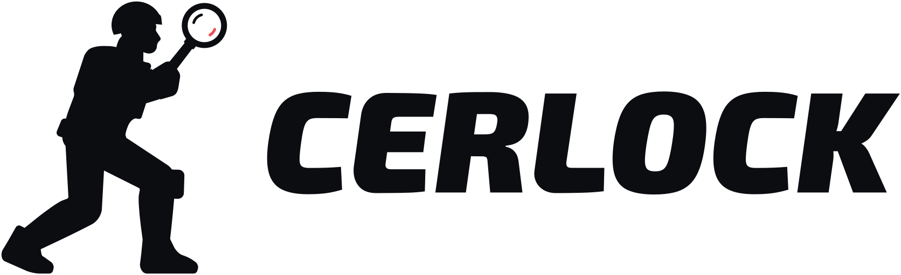
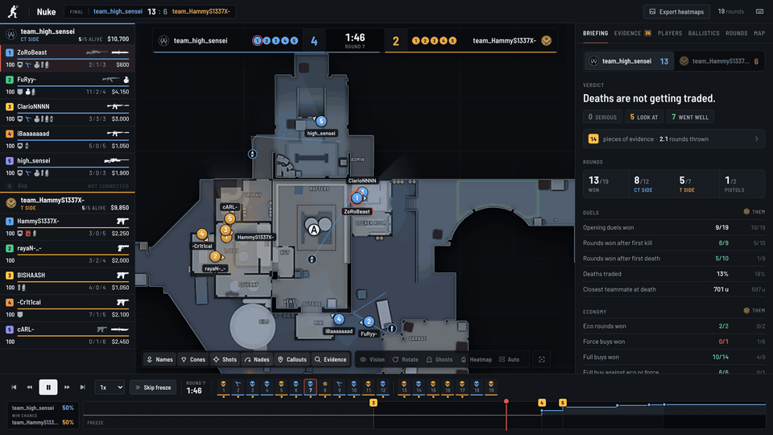
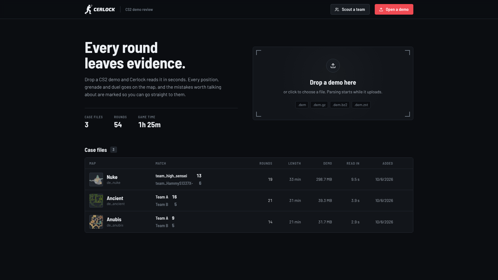
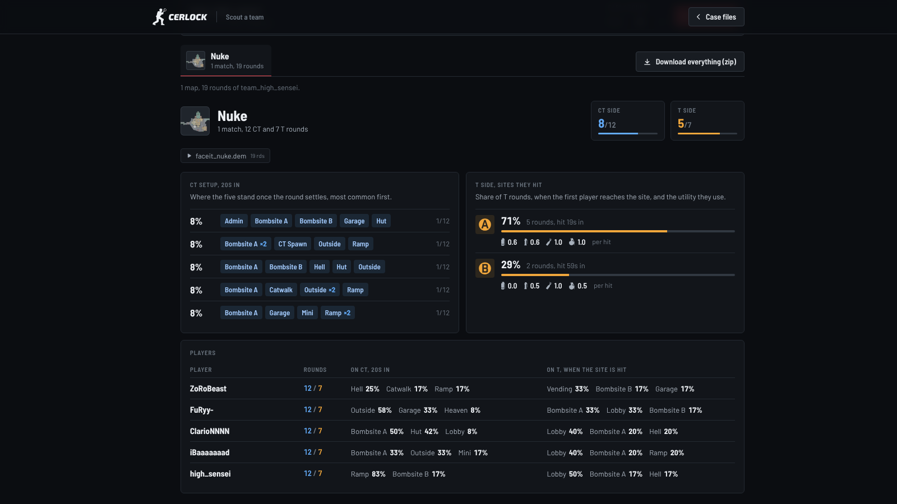
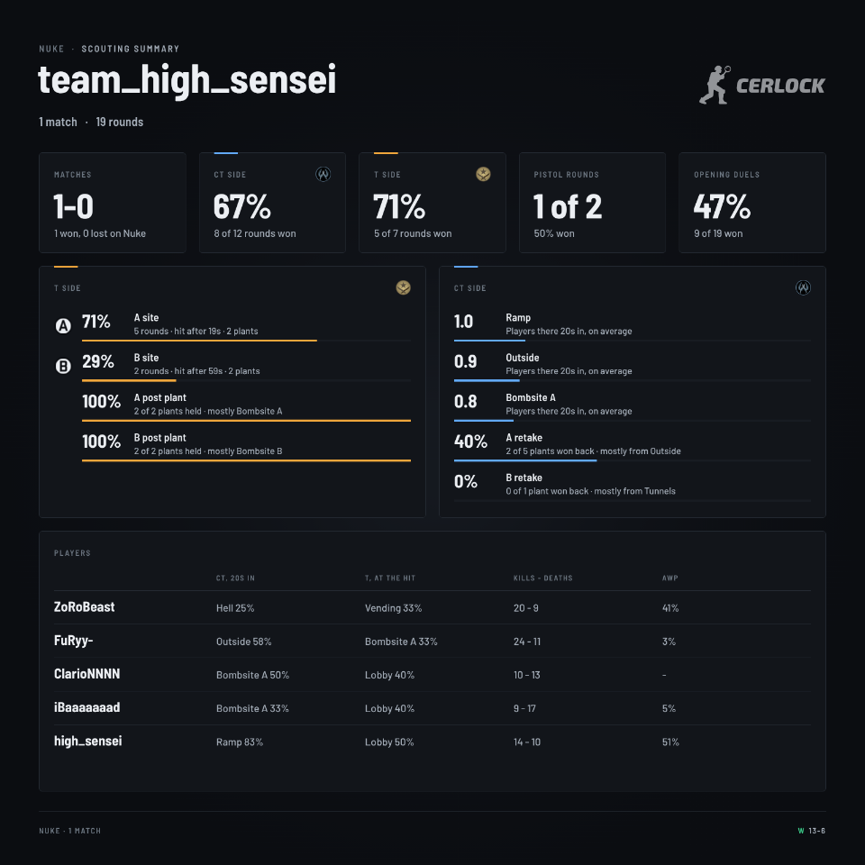
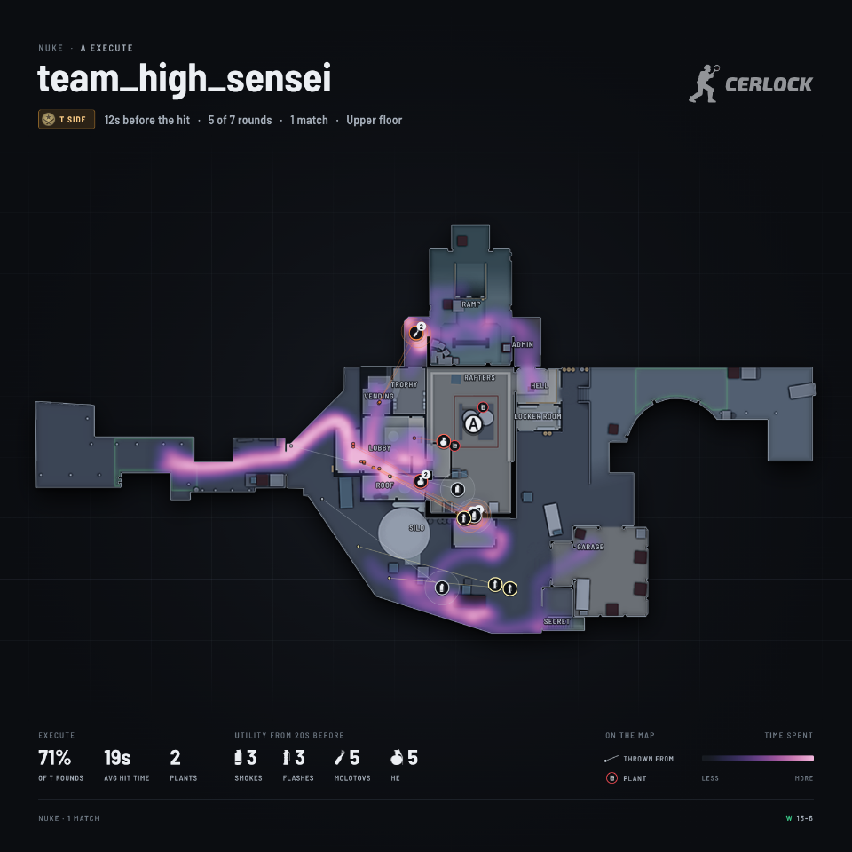

<p align="center">
  <picture>
    <source media="(prefers-color-scheme: dark)" srcset="web/src/assets/brand/lockup-dark.svg">
    
  </picture>
</p>

<h3 align="center">A free and open source CS2 demo reviewer for teams</h3>

<p align="center">
  Watch any demo on a 2D radar, see the mistakes that cost you rounds, and scout your next opponent from the FACEIT games they played together. Runs on your own PC.
</p>

<p align="center">
  <a href="https://github.com/abdurryy/CerlockCS/releases/latest"></a>
  <a href="LICENSE"></a>
  <a href="https://github.com/abdurryy/CerlockCS/actions/workflows/ci.yml"></a>
</p>

<p align="center">
  <a href="https://github.com/abdurryy/CerlockCS/releases/latest"></a>
  &nbsp;
  <a href="https://github.com/abdurryy/CerlockCS/releases/latest"></a>
</p>

<p align="center">
  <sub>One file. No account, no install, nothing uploaded. Windows 10 and 11, Linux, macOS (Intel and Apple Silicon).</sub>
</p>

<p align="center">
  
</p>

## Why

I play ESEA league and FACEIT with my team. We wanted one place to review our own games and to prepare for the team we play next week. It had to be free, so everyone on the team could use it, and fast, so nobody loses interest while a demo loads. So I built it.

- **Free and open source.** No subscription, no account, no ads. MIT license.
- **Runs on your PC.** Demos are parsed on your machine and never leave it.
- **Fast.** A 299 MB FACEIT demo is ready in about 7.6 seconds, a 39 MB matchmaking demo in about 3.5.
- **Made for teams.** It shows the single moments that lost rounds and how much win chance each one cost. Click one and you are watching it.
- **Scouting.** Paste your next opponent's FACEIT room. Cerlock finds the games where 4 or 5 of them queued together and makes a report per map, with images you can post straight in your team's Discord.

The name is Sherlock with the "Sh" swapped for the C in CS. A demo is a case: every round leaves evidence, and Cerlock lays it out for you.

## Features

### Replay


- Players in their team colour with a pointer for where they look and a health ring, plus the real CS2 icons for weapons, grenades, armor, kit and bomb in the roster and the killfeed (headshot, wallbang, no-scope, through smoke and blind too)
- Smokes with a countdown ring, molotov fire, HE and flash pops, grenade paths, shot tracers, kill lines and the bomb
- A line from every flash to the players it blinded, with the blind time (red when it was a teammate)
- Callouts (Ramp, Heaven, Outside...) taken from the demo itself, and the game's A and B badges on the sites
- Follow a player by clicking them or pressing 1 to 0, and rotate the map with their view if you want
- Team vision: only show the enemies the followed player's team could actually see
- Ghosts: where a team stood at the same moment in every other round on that side. Good for spotting setups and habits
- Heatmaps of positions, kills and deaths, per player, per team or for one callout
- Two floor maps (Nuke, Train, Vertigo) switch floor by themselves

### Evidence

Cerlock goes through every round and pulls out single mistakes you can watch. Each one gets a numbered marker on the map and the timeline. Click it and the replay jumps to a few seconds before and follows the player.

- Team kills, team damage and dying to a teammate's flash
- Dying mid reload, or blind from your own flash
- Peeking into a crossfire, or staying on the same angle after a kill and getting traded
- Dying with a lot of unused utility, or without armor on a buy round
- The bomb carrier taking the first fight, running out of time on T side, dying to the bomb, starting the defuse too late
- Buying out of sync with the team, molotovs that burned for a second, shooting while running and losing the duel

Every mistake has a cost: how much it dropped the team's chance to win the round. That makes it easy to sort the small stuff from what actually lost rounds.


### Win chance

- A simple model of players alive and the bomb gives a win chance for every moment of the round, drawn on the timeline. It does not look at weapons or time yet, so read it as a rough guide
- Round swing per player: how much each player moved their team's win chance over the match, from kills, deaths and plants

### Team review

- Opening duels, traded deaths, rounds won after the first kill, pistols, eco and anti-eco rounds, post plants and retakes, utility per round, team flashes and unused utility
- Findings like "Deaths are not getting traded", "Losing anti-eco rounds" or "Losing fights at Bombsite A", each with the rounds and ticks it is based on
- Map control: kills and deaths per callout and side, where the team keeps losing fights, and how long it spends in each area
- Round notes: the setup each team played, when and where the T side hit, and a short story of the round (opening kill, trades, big swings, clutches)

### Player report

- K/D/A, ADR, KAST, HLTV 1.0 rating, kills and deaths per round and round swing, split by CT and T side
- Opening duels, trades and time to trade, isolated and early deaths, clutches, multi kills
- Utility: blind time per flash, damage per HE and molotov, teammates flashed
- Movement: time alive, distance travelled, shots fired while standing still, kill distance
- Kills per weapon, and the callouts where a player gets the most kills and dies the most
- Personal findings, like dying where nobody can trade, flashing teammates, shooting while moving or crosshair placement

### Aim

- Every duel is cut out at full tick rate and measured: crosshair placement when the enemy showed up, reaction time, time to damage, first shot error and flick size
- A chart of how far the crosshair was from the enemy's head over the whole fight
- Numbers are compared against everyone else in the same game


### Library

- Drag and drop a demo, or point Cerlock at a folder. Your CS2 replays folder is picked up by itself and new demos are parsed in the background
- FACEIT demos you download in the browser are picked up from your Downloads folder
- Reads `.dem` as well as compressed `.dem.gz`, `.dem.bz2` and `.dem.zst`



## Scouting a team

Teams in ESEA often have few league games to look at, but their players queue FACEIT together to practice. Cerlock finds those games and turns them into a report per map: where every player stands, where they set up early on CT and which sites they hit on T with what utility.

1. Create a FACEIT API key: sign in at [developers.faceit.com](https://developers.faceit.com), make an app and add a server side API key. Paste it into Cerlock's settings. It is saved in `settings.json` in the data folder, readable only by your user, and never sent back to the browser.
2. Paste the opponent's match room link (`https://www.faceit.com/en/cs2/room/1-...`) or their team page. Cerlock lists both teams with their players.
3. Cerlock walks the last 100 matches of every player and keeps the ones where at least four of them were on the same side, newest first, with the map, the score and a link to the match room. You also see their map pool.
4. Get the demos. Open each match room and click "Watch demo". Cerlock watches your Downloads folder and picks FACEIT demos up by itself (turn it off with `--downloads=false`), or you can drop them in. They are matched to the players by SteamID. If your key has download access (see the [FAQ](#faq)), Cerlock downloads them itself into `demos/faceit` in the data folder.
5. Build the report. For every map you get 30+ PNG images in one style, with the team or player name in the top corner and the Cerlock logo in the other: a summary card, the whole team on CT and T, T executes per site with the utility and plants, post plant and retake positions, opening duels, utility with throw lines, pistol and eco rounds, AWP spots, kills and deaths, and per player their early CT and T positions. Download them one by one or as a zip per map.



<p>
  
  
</p>

The same exports work on a single demo: open it, click "Export heatmaps" (top right, or in the Players tab) and pick a team to get one image per player plus one for the whole team.

The key can also be given with `--faceit-key` or the `FACEIT_API_KEY` environment variable. A key saved in the settings wins.

## Getting started

Download the latest version from the [releases page](https://github.com/abdurryy/CerlockCS/releases/latest).

- **Windows**: download `cerlock-<version>-windows-amd64.exe` and double click it. Cerlock opens as its own app window, and demos in your CS2 replays folder show up by themselves. Right click its taskbar icon and pick "Pin to taskbar" to keep it handy. Closing the window quits Cerlock. The window uses the Microsoft Edge WebView2 Runtime, which most Windows 10 and 11 PCs already have. If yours does not, Cerlock opens in your browser instead and tells you where to get it. Windows will probably warn you about an unknown publisher, see [the FAQ](#why-does-windows-warn-me-about-an-unknown-publisher).
- **Linux and macOS**: download the `.tar.gz` for your system, extract it and run `./cerlock`. The viewer opens in your browser.

Then drop a demo on the page. Replays, radar images and icons are stored in `.cerlock` in your home folder. On Windows the app also keeps its log there, in `cerlock.log`.

If your Steam library is not in the default place, point Cerlock at your replays folder from a terminal:

```sh
cerlock serve --demos "D:\SteamLibrary\steamapps\common\Counter-Strike Global Offensive\game\csgo\replays"
```

Other options:

```
--addr        address to listen on (default 127.0.0.1:7350)
--data        where replays and map images are stored (default ~/.cerlock)
--demos       folder with demos, can be given more than once
--watch       parse new demos in the demo folders in the background (default true)
--downloads   pick up FACEIT demos saved in the Downloads folder (default true)
--offline     never download radar images or icons
--workers     demos parsed at the same time
--faceit-key  FACEIT Data API key for scouting (FACEIT_API_KEY works too)
--open        open the viewer in the browser
```

There is also a CLI mode that only parses, handy for benchmarking: `cerlock parse match.dem`.

## Keyboard shortcuts

| Key | Action |
| --- | --- |
| Space | Play / pause |
| Left / Right | Back / forward 5 seconds (Shift for 1 second) |
| P / N | Previous / next round |
| [ / ] | Slower / faster |
| 1 to 0 | Follow a player |
| Esc | Stop following |
| R | Rotate the map with the followed player |
| V | Team vision |
| G | Ghosts |
| E | Evidence markers |
| C | Callouts |
| H | Names |
| L | Switch floor |
| ? | Show all shortcuts |

## How it compares

There are good tools out there already, and most of them do things Cerlock does not. This is only here to help you pick. Prices and plans change, so check their sites too (last checked October 2026).

| | Cerlock | [CS Demo Manager](https://github.com/akiver/cs-demo-manager) | [Leetify](https://leetify.com) | [Refrag](https://refrag.gg) | [Skybox](https://skybox.gg) |
| --- | --- | --- | --- | --- | --- |
| Price | Free | Free | Free, Pro is paid | Paid plans | Limited free option, paid plans |
| Open source | Yes, MIT | Yes, MIT | No | No | No |
| Runs | On your PC | On your PC | In the browser | In the browser, plus practice servers | In the browser |
| Known for | Team review and scouting | Managing a big demo collection, stats, playback in CS2 and recording videos | Your own stats after every game, tracked over time | Practice servers and drills, with a 2D viewer | Analysis used by a lot of pro teams |

Like CS Demo Manager, Cerlock is free, open source and runs on your PC. What it adds:

- It finds single mistakes in every round and puts a number on each one: how much win chance it cost. Every one links to the moment, so you can watch it together in review.
- Scouting starts from a FACEIT room or team page. It finds the games where 4 or 5 of the opponent's players queued together and turns them into a report per map.
- One file, no account, and a full FACEIT demo is ready in seconds.

What it does not do (yet): there is no in game playback or video recording, no stats tracked across your whole match history, no 3D view and no hosted web version.

## FAQ

#### Is it safe? Can it get me VAC banned?

Cerlock never touches the game. It does not inject anything, hook into CS2 or read its memory, and it does not even need CS2 installed. It only reads demo files, the ones you download from your match history or a FACEIT room.

#### Does it upload my demos?

No. Everything runs on your PC and your demos stay there. Cerlock only goes online to download radar images and weapon icons the first time it needs them (turn that off with `--offline`), and to talk to the FACEIT API when you scout. There is no tracking of any kind.

#### Why does Windows warn me about an unknown publisher?

The exe is not code signed. A certificate costs money every year and this is a free project, so SmartScreen warns about it. Click "More info" and then "Run anyway". Every release is built by GitHub Actions straight from this repo ([release.yml](.github/workflows/release.yml)), and `checksums.txt` on the release has the SHA-256 of every file. If you would rather not run a binary from the internet at all, you can [build it yourself](#building-from-source).

macOS may block it for the same reason. Allow it once under System Settings, Privacy & Security, or run `xattr -d com.apple.quarantine cerlock` in the folder you extracted.

#### Which demos work?

CS2 demos from Valve matchmaking and Premier, Wingman and FACEIT. Pro demos from HLTV should work too. Extract the `.dem` from the `.rar` first. CS:GO demos do not work, only CS2. If a demo does not load or something looks wrong, [open an issue](https://github.com/abdurryy/CerlockCS/issues/new?template=bug_report.yml) with a link to the demo.

#### Why do I have to download FACEIT demos myself?

Downloading demos through the FACEIT API needs a special permission from FACEIT that a normal API key does not have. So you open each match room and click "Watch demo". That is two clicks per match. Cerlock picks the file up from your Downloads folder by itself. If your key does have download access, Cerlock downloads them for you.

#### Is there a web version?

No. Cerlock runs on your PC only. That keeps it free and keeps your demos with you.

## Speed

Nobody on my team wanted to wait for a demo to load, so speed was the main thing I designed around. Measured on a 4 core machine:

| Demo | Size | Parse + analysis | Replay file |
| --- | --- | --- | --- |
| FACEIT 5v5, Nuke, 64 tick | 299 MB | 7.6 s | 2.6 MB |
| Matchmaking, Ancient | 39 MB | 3.5 s | 1.7 MB |
| Matchmaking, Anubis | 32 MB | 2.5 s | 1.2 MB |
| Wingman, Overpass (gzipped upload) | 20 MB | 0.9 s | 0.5 MB |

Opening a replay that is already parsed takes around 200 ms in the browser (a bit more the first time, when the map image is fetched).

What makes it fast:

- **One pass over the demo.** Positions, events, grenades and the aim windows are all collected in the same pass. The hot loop reads entity properties directly instead of going through helpers that look up the same entity many times, which cut parse time on the big demo from 12.3 s to about 7 s.
- **Parsing while uploading.** The server parses the upload as a stream, so the replay is ready right after the last byte arrives.
- **No duplicate work.** A demo is identified by its size and first megabyte. The browser computes the same fingerprint, so a demo that was parsed before opens without uploading anything.
- **A replay format the browser does not need to parse.** A small JSON header plus raw typed columns (positions, angles, health...), gzipped. The browser wraps them in typed arrays without copying.
- **Background parsing.** Demo folders are watched and new demos are parsed in parallel, so they are ready before you open them.
- **A light frontend.** Svelte compiles away, so there is no virtual DOM. The radar is a canvas running at 60 fps, while the side panels only update about 15 times per second.

Before picking the parser I also tried demoparser2 (Rust) on the same 299 MB demo. Getting ticks, events and grenades took 9.6 s since each one is a separate pass, so the single pass approach with demoinfocs ended up faster for this use case.

### Tech stack

| Part | Choice | Why |
| --- | --- | --- |
| Demo parsing | Go + [demoinfocs-golang](https://github.com/markus-wa/demoinfocs-golang) | Mature CS2 parser with a full game state (grenades, infernos, spotted flags, view angles), easy to run everything in one pass |
| Server | Go standard library | One binary with the frontend embedded, nothing else to install |
| Frontend | Svelte 5, TypeScript, Vite | Small bundle (about 130 kB of gzipped JS) and fine grained updates |
| Rendering | Canvas 2D | Plenty for 10 players and a few dozen effects at 60 fps, no WebGL needed |
| Replay format | Own binary format | Typed columns that load straight into the browser |

## How the maps are rendered

CS2 ships a 1024x1024 radar image for every map and an overview file (`resource/overviews/<map>.txt`) that says where the image sits in the world: the world position of the top left corner and how many world units one pixel covers.

```
"de_mirage"
{
    "pos_x"   "-3230"
    "pos_y"   "1713"
    "scale"   "5.00"
}
```

So a world position becomes a radar pixel with:

```
px = (x - pos_x) / scale
py = (pos_y - y) / scale     (y is flipped, world y goes up and image y goes down)
```

Maps with two floors (Nuke, Train, Vertigo) have a second image and an altitude where the floors meet. Nuke uses the lower image below z = -495. The viewer picks the floor of the followed player, or you can switch with `L`. Players on the other floor are drawn faded.

Where the images come from:

1. The first time a map is opened, the server downloads the radar image and overview file and caches them in `~/.cerlock/maps`. The source is [MurkyYT/cs2-map-icons](https://github.com/MurkyYT/cs2-map-icons), which pulls them from the game depot after every CS2 update, so new maps and map updates show up without changes here.
2. You can export them from your own game files with `scripts/extract-radars.sh` (or `.ps1` on Windows). It uses [Source2Viewer-CLI](https://github.com/ValveResourceFormat/ValveResourceFormat) to decompile `panorama/images/overheadmaps/*.vtex_c` to PNG.
3. If there is no image at all (offline, a custom map), the viewer draws a floor plan from everywhere the players walked in the demo. It is surprisingly readable. The active duty maps also have their calibration built in, so positions stay correct without the overview file.

## Aim analysis

For every fight the parser keeps a short window of the attacker's view angles and both players' positions at full tick rate (2 seconds before the first hit until the kill). From that it calculates:

- **Crosshair placement**: the angle between where the attacker was looking and the enemy's head at the moment the enemy was spotted
- **Reaction time**: spotted to first shot. Shots under 80 ms are counted as prefires instead
- **Time to damage**: spotted to first hit
- **First shot error** and **flick size**
- Duels won and lost, duels lost without firing, accuracy inside duels

"Spotted" comes from the game's own radar spotting (`m_bSpottedByMask`), which can be a few ticks behind real line of sight. The raw samples (yaw, pitch and angle to the head per tick) are stored in the replay, so new metrics can be added without parsing the demo again.

Counter strafing is already in: every shot stores the player's speed, and a shot counts as "still" when the player was slow enough for the weapon to be accurate.

## Building from source

You need Go 1.25+ and Node 22+.

```sh
git clone https://github.com/abdurryy/CerlockCS
cd CerlockCS
make build
./bin/cerlock serve --open
```

For development:

```sh
make dev     # Go server on :7350 and Vite on :5173 with hot reload
make test    # go vet, go test, svelte-check and vitest
```

More in [CONTRIBUTING.md](CONTRIBUTING.md).

## Project layout

```
cmd/cerlock          CLI, server and the Windows app window
internal/parse       single pass demo parser built on demoinfocs
internal/aim         duel windows and aim metrics
internal/analysis    stats, findings, mistakes, win chance and round notes
internal/match       the parsed match model
internal/replay      replay file writer
internal/maps        overview files, radar images and the map cache
internal/pipeline    decompress, parse, analyse, write
internal/faceit      FACEIT API client and the search for games played together
internal/icons       weapon and killfeed icons, downloaded and cached
internal/server      HTTP API, library and background parsing
web/                 Svelte frontend
scripts/             radar and icon export from your own game files
```

## Roadmap

What I want to add next. If one of these matters to your team, say so in [Discussions](https://github.com/abdurryy/CerlockCS/discussions), it helps me pick.

- [ ] Veto history and half scores in the scouting report
- [ ] Buy prediction for the next round
- [ ] A timeline of the utility in an execute: what was thrown, where, and when
- [ ] Timeouts
- [ ] Export lineups as `setpos` commands you can paste in a practice server
- [ ] Self scout: the scouting report for your own team
- [ ] Multi round overlay: several rounds on the map at the same time
- [ ] Exact line of sight from the map's collision mesh, instead of radar spotting
- [ ] Spray control, using the recoil index and the shot pattern per weapon

## Contributing

Bug reports, ideas and PRs are all welcome. If you play CS and know what your team's review is missing, that helps as much as code.

- [CONTRIBUTING.md](CONTRIBUTING.md) has how to build it, how the code is laid out and how to add a new mistake or scouting image.
- The [good first issues](https://github.com/abdurryy/CerlockCS/issues?q=is%3Aissue%20is%3Aopen%20label%3A%22good%20first%20issue%22) are a good place to start.
- A demo that does not load or looks wrong? [Open a bug report](https://github.com/abdurryy/CerlockCS/issues/new?template=bug_report.yml), with a link to the demo if you can share it.
- Questions and ideas go in [Discussions](https://github.com/abdurryy/CerlockCS/discussions).

If Cerlock helps your team, a star helps other teams find it.

## Design

Dark, sharp and close to the game's own HUD, without looking like an esports overlay or a generic dashboard. The map, the players and the utility get the colour, the interface around them stays calm. One red for what matters, amber for evidence, blue and gold for the two sides, Barlow and Barlow Semi Condensed for all text, and the real CS2 icons for anything in the game. The logo is a CT operator holding a magnifying glass. The full notes are in [docs/BRAND.md](docs/BRAND.md).

## Credits

- [demoinfocs-golang](https://github.com/markus-wa/demoinfocs-golang) for the demo parsing
- Radar images and overview data belong to Valve. They are not stored in this repository
- Test demos from the demoinfocs test set ([cs-demos-2](https://gitlab.com/markus-wa/cs-demos-2))
- Fonts: [Barlow and Barlow Semi Condensed](https://github.com/jpt/barlow) under the SIL Open Font License, bundled through Fontsource
- Weapon, utility and killfeed icons belong to Valve. Like the radar images they are not stored here: Cerlock downloads them on first use from [drweissbrot/cs-hud](https://github.com/drweissbrot/cs-hud) and [akiver/cs-demo-manager](https://github.com/akiver/cs-demo-manager), or you can export them from your own game files with `scripts/extract-icons.sh`
- The CERLOCK wordmark is drawn from [Exo 2](https://github.com/NDISCOVER/Exo-2.0) (SIL Open Font License)

## License

MIT, see [LICENSE](LICENSE).
